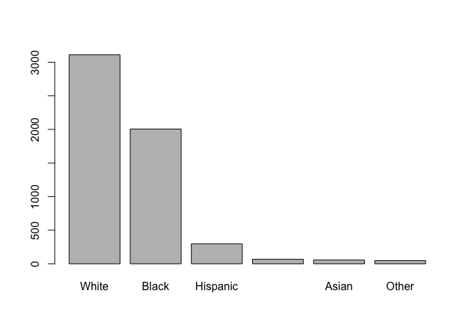
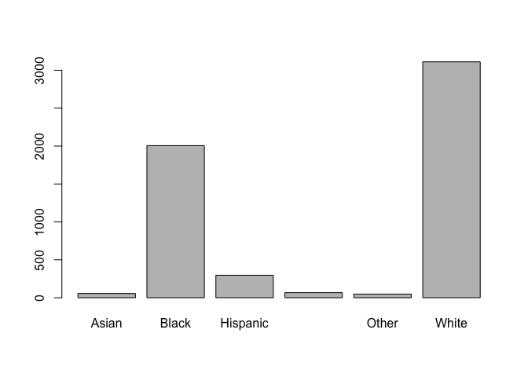

Learning Factors
================

``` r
# Data downloaded from https://opendurham.nc.gov/explore/dataset/north_carolina_bicycle_crash_data_heatmap_/?tab=metas
# Data load code from http://www2.stat.duke.edu/~mc301/data/nc_bike_crash.html

bike <- read.csv("https://stat.duke.edu/~mc301/data/nc_bike_crash.csv", 
                 sep = ";", stringsAsFactors = FALSE, na.strings = c("NA", "", ".", "/Missing"))
```

Factors in R
------------

Categorical, or discrete, variables can be either nominal (e.g., male/female) or ordinal (e.g., January/February/March/etc.). Most datasets have at least one categorical variable. Sometimes, the original dataset uses a numerical code that stands in for the name of a category (e.g., "1" for male and "2" for female), whether the categories have an inherent order or not. Other datasets may include the full category name, and if there is an inherent order it may be understandable to the human viewer but not by the computer.

In R, factors are a way of specifying some extra information about categorical variables that might be useful for data analysis or visualization. The primary information you might want to specify are **levels**, **labels**, and whether the factor should be considered **ordered**.

Creating a factor
-----------------

The basic process of creating a factor is sending a vector of values to the `factor()` command.

``` r
race <- factor(bike$Bike_Race)
summary(race)
```

    ##           Asian           Black        Hispanic Native American 
    ##              56            2006             297              67 
    ##           Other           White            NA's 
    ##              48            3111             131

If you try to look at the factor, it will print out just like the original data did, with one major exception. On your own, type just the name of the factor into the command line and hit enter.

``` r
race
```

You should see a list of every single data value in the factor, but you should also see a line at the end:

`Levels: Asian Black Hispanic Native American Other White`

So, what did the `factor()` command do? Well, first it went through the original data values and found all of the unique category names. (Note: if the data start out as numbers, `factor()` starts out by converting them to text with `as.character()`. Also, by default, `factor()` excludes "NA" from the list of levels.)

Since we didn't pass the function any additional information about these data, R doesn't know anything else about these particular values. Next, it sets the factor *levels* using the categories it found, placed in alphabetical order. This results in the list of levels we saw at the end of the list of data values.

For many categorical variables, this default behavior may be fine. If you know additional information about your data, however, it may be better to add levels or labels manually, or to specify that the levels are ordered. (For this reason, it is often a good idea to prevent R from converting character variables to factors on data import. Use the `stringsAsFactors = FALSE` option when reading csv files, etc.)

Levels
------

You can specify any order for the levels; you don't have to be locked into alphabetical order. One reason you may want an alternative order for the levels is that the categories have a **natural order** -- for example, the months of the year.

``` r
# example from https://www.stat.berkeley.edu/classes/s133/factors.html

mons <- c("March","April","January","November","January","September","October","September",
         "November","August","January","November","November","February","May","August","July",
         "December","August","August","September","November","February","April")

mons.factor <- 
    factor(mons,
           levels=c("January","February","March","April",
                    "May","June","July","August",
                    "September","October","November","December"))
```

When you add the `levels` argument to the factor command, you pass it a vector of all of the categories, placed in the proper order. You can also set the levels on an existing factor by using the `levels()` command.

In the following example, the categories don't really have a natural order, but we might prefer that the "Other" category appears at the end. This is more of a *logical* order than a natural order.

``` r
race <- factor(bike$Bike_Race, levels = c("Asian","Black","Hispanic","Native American","White","Other"))

# You can check the levels by using levels() with the factor.

levels(race)
```

    ## [1] "Asian"           "Black"           "Hispanic"        "Native American"
    ## [5] "White"           "Other"

Another reason you might set levels is that there may be a difference in frequency of the different categories. Using frequency to order category is a **data-driven** (or just *useful*) order, and can make tables or visualizations based on this data more effective.

``` r
# This command takes a frequency table of the race categories, 
# sorts it in decreasing order, and then pulls out just the names, 
# which are used as the levels.

race <- factor(bike$Bike_Race, levels = names(sort(table(bike$Bike_Race),decreasing=TRUE)))

levels(race)
```

    ## [1] "White"           "Black"           "Hispanic"        "Native American"
    ## [5] "Asian"           "Other"

``` r
plot(race)
```



``` r
# If you don't believe this makes a difference, try plotting the original data.
# Isn't it much nicer in order?

barplot(table(bike$Bike_Race))
```



Labels
------

Labels can be used if you want just want to rename the original category names. This is common when a number code is used for categories, but it can also come in handy with data values that start out as text.

``` r
mons.factor <- 
    factor(mons,
           levels=c("January","February","March","April",
                    "May","June","July","August",
                    "September","October","November","December"),
           labels=c("Jan", "Feb", "Mar", "Apr", "May", "Jun", 
                    "Jul", "Aug", "Sep", "Oct", "Nov", "Dec"))

mons.factor
```

    ##  [1] Mar Apr Jan Nov Jan Sep Oct Sep Nov Aug Jan Nov Nov Feb May Aug Jul
    ## [18] Dec Aug Aug Sep Nov Feb Apr
    ## Levels: Jan Feb Mar Apr May Jun Jul Aug Sep Oct Nov Dec

Note that even when you just type the name of the variable to view the data in the factor, the data values are displayed with the labels you have specified.

Ordered
-------

The `ordered` attribute can be specified as *TRUE* or *FALSE*. By default, it is set to FALSE. You may want to set the value to TRUE for variables that are truly ordinal - that is, when there is a natural ordering that is not dependent on the frequency of the category.

``` r
mons.factor <- 
    factor(mons,
           levels=c("January","February","March","April",
                    "May","June","July","August",
                    "September","October","November","December"),
           labels=c("Jan", "Feb", "Mar", "Apr", "May", "Jun", 
                    "Jul", "Aug", "Sep", "Oct", "Nov", "Dec"),
           ordered=TRUE)

mons.factor
```

    ##  [1] Mar Apr Jan Nov Jan Sep Oct Sep Nov Aug Jan Nov Nov Feb May Aug Jul
    ## [18] Dec Aug Aug Sep Nov Feb Apr
    ## 12 Levels: Jan < Feb < Mar < Apr < May < Jun < Jul < Aug < Sep < ... < Dec

Notice how the printing of the levels at the bottom uses "&lt;" to indicate that values on the left are "less than" values on the right. This isn't just a coincidence; you can actually compare categories with the "&lt;" operator.

``` r
mons.factor[1] < mons.factor[2] # Translates to "Mar < Apr"
```

    ## [1] TRUE

``` r
mons.factor[2] < mons.factor[3] # Translates to "Apr < Jan"
```

    ## [1] FALSE

``` r
race[7] < race[8] # Translates to "Black < Hispanic"
```

    ## Warning in Ops.factor(race[7], race[8]): '<' not meaningful for factors

    ## [1] NA

So, even if we have specified an order for the levels, it's not truly "ordered" unless you set `ordered = TRUE`. You can't use comparisons like "&lt;" on an unordered factor.

The order of the levels is useful for display in tables or charts, but you should only set it as an ordered factor if there is a natural ordering. That distinction may make a difference for certain types of analysis.

When to use factors?
--------------------

As we've said, factors are useful for tables and plot. In additiona, some analysis functions like regressions actually do pay attention to factors. For example, when you use a factor as an independent variable for a regression, R knows to create [dummy variables](https://www.r-bloggers.com/data-types-part-3-factors/) of the categories.
